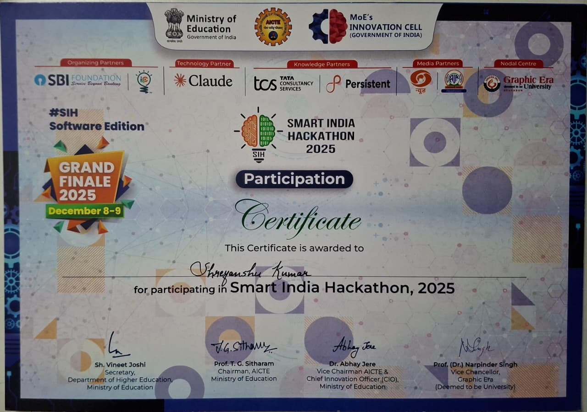

# Shreyanshu Kumar | Developer Portfolio

 <!-- Replace with an actual hero screenshot of your portfolio -->

A highly responsive, premium personal portfolio showcasing my expertise as a Frontend & Full Stack Developer. Built from the ground up with **React (Vite)**, customized with a modern **Black, Orange, and White** dark theme, and intricately animated using **Framer Motion**.

---

## ✨ Features

- **Dynamic Hero Section**: Features a custom typewriter effect and a fluid, interactive liquid glass code card.
- **High-Impact Aesthetics**: Deep dark (`#050505`) backgrounds paired with vibrant orange accents (`#f97316`) and robust glassmorphism UI elements.
- **Fluid Animations**: Utilizing *Framer Motion* for smooth scroll reveals, stagger transitions, hover lifts, and glowing micro-interactions.
- **Fully Responsive**: Architected with Tailwind CSS to ensure pixel-perfect rendering across mobile, tablet, and ultra-wide desktop viewports.
- **Working Contact Form**: Integrated with Web3Forms to capture direct user messages directly to email.
- **Optimized Performance**: Built on Vite for lightning-fast HMR and highly optimized production builds.

---

## 🛠️ Tech Stack

**Core Architecture:**
- [React](https://reactjs.org/) (Frontend logic)
- [Vite](https://vitejs.dev/) (Build tool & development server)

**Styling & UI:**
- [Tailwind CSS](https://tailwindcss.com/) (Rapid utilitarian styling)
- [Framer Motion](https://www.framer.com/motion/) (Complex declarative animations)

**Integrations:**
- [Web3Forms](https://web3forms.com/) (Contact form handling without a traditional backend)

---

## 🚀 Getting Started

To run this project locally, follow these steps:

### Prerequisites
Make sure you have [Node.js](https://nodejs.org/) installed on your machine.

### Installation

1. **Clone the repository:**
   ```bash
   git clone https://github.com/Shreyanshu-Gupta/Portfolio.git
   ```

2. **Navigate to the project directory:**
   ```bash
   cd Portfolio
   ```

3. **Install dependencies:**
   ```bash
   npm install
   ```

4. **Start the development server:**
   ```bash
   npm run dev
   ```

5. Open your browser and navigate to `http://localhost:5173` to see the application running.

---

## 📂 Project Structure

```text
├── public/                 # Static assets (images, pdfs, favicon)
├── src/
│   ├── components/         # Reusable React components (Navbar, Hero, Projects, etc.)
│   ├── data/               # Local JSON/JS data separating logic from UI (projects.js)
│   ├── App.jsx             # Main application entry component
│   ├── index.css           # Global Tailwind directives & custom variables
│   └── main.jsx            # React DOM mounting
├── tailwind.config.js      # Tailwind theme extensions
└── vite.config.js          # Vite build configuration
```

---

## 🔗 Connect with Me

- **LinkedIn**: [in/shreyanshu-gupta](https://www.linkedin.com/in/shreyanshu-gupta/)
- **X (Twitter)**: [@HIM4NSHUGUPT4](https://x.com/HIM4NSHUGUPT4)
- **Email**: [work.shreyanshu@gmail.com](mailto:work.shreyanshu@gmail.com)

---

*Designed and engineered by Shreyanshu Kumar © 2026.*
